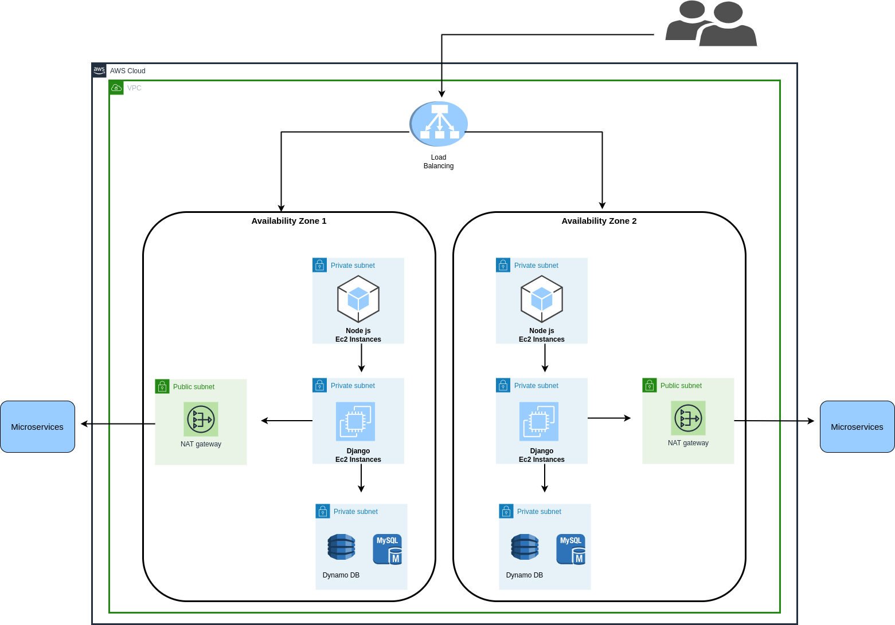

# Diagrama de red de una aplicacion web en AWS

Para diseñar la arquitectura de una aplicacion web para ser alojada en AWS, se siguio como guia el modelo de 3 niveles, que se compone comúnmente de los niveles web, de aplicación y de datos.

Desde el punto de vista de la seguridad, esta arquitectura utiliza buenas prácticas en cuanto al aislamiento de la red: uso de VPC, segmentación de redes públicas y privadas y uso de NAT Gateway para acceder a Internet desde recursos privados.

Se utilizaron los siguientes componentes de Amazon:

- Amazon Elastic Compute Cloud (Amazon EC2): Ofrece capacidad computacional en la nube de Amazaon Web Services.
  - Ofrece entornos virtuales, conocidos como instancias, donde se van a poder alojar las aplicaciones.
  
- Amazon Virtual Private Cloud (Amazon VPC): Permite aprovisionar una sección aislada privada de la nube de AWS, donde se puede lanzar servicios de AWS y otros recursos en la red virtual que se defina.
  - Se Puede controlar todos los aspectos del entorno de red virtual, incluida la selección de un intervalo de direcciones IP, la creación de subredes y la configuración de tablas de ruteo y gateways de red.

- Elastic Load Balancing (ELB): Distribuye el tráfico a través de múltiples instancias de EC2.
  - Provee alta disponibilidad dentro de la región proveyendo balanceo a través de múltiples AZ.
  - Adicionalmente se puede integrar sin problemas con el servicio Auto Scaling, para escalar el número de instancias de EC2.
  
- Gateway NAT: las gateways NAT son dispositivos de traducción de direcciones de red (NAT) que proporcionan acceso de salida a Internet a las instancias de las subredes privadas, pero impiden que Internet tenga acceso a esas instancias.
- Myqsl: base de datos relacional.
- Dynamo BD: base de datos no relacional.

## Links

- https://aws.amazon.com/es/blogs/aws-spanish/protegiendo-su-pagina-web-con-aws-waf-y-amazon-cloudfront/
- https://d1.awsstatic.com/whitepapers/aws-web-hosting-best-practices.pdf
- https://docs.aws.amazon.com/es_es/vpc/latest/userguide/VPC_Scenario3.html
